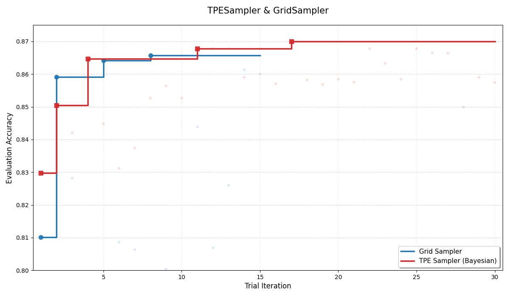
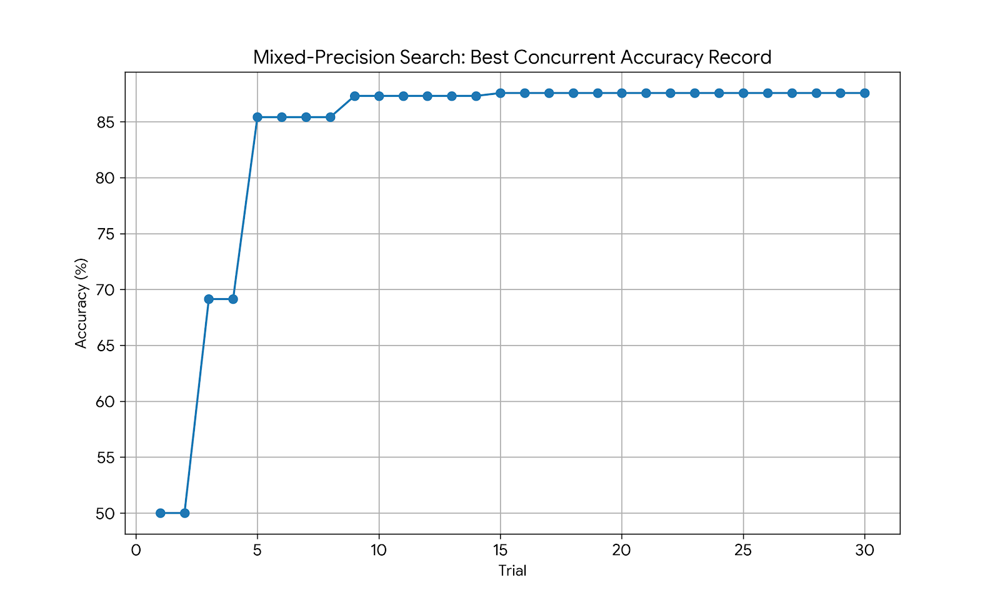
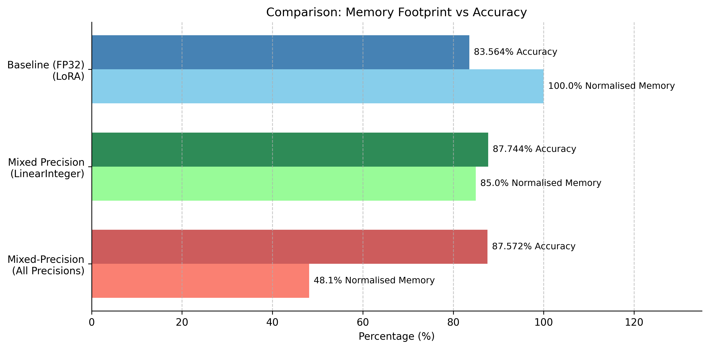
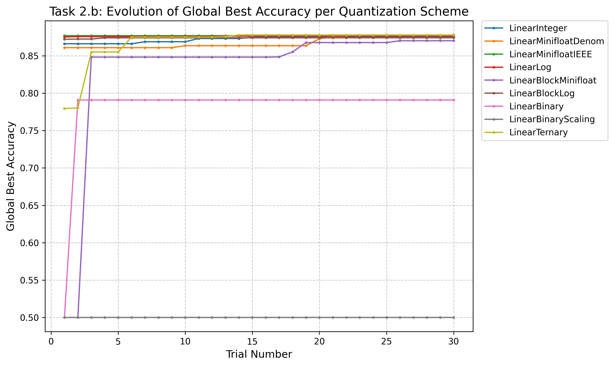

# ADLS Reports 

## Group Members

| Name          | CID      |
|---------------|----------|
| Zhihao Jia    | 02215217 |
| Tingxu Chen   | 02221097 |
| Hong Huang    | 06047205 |
| Leon Hausmann | 06046667 |

## Lab 0

### What we should do and what we did
In this lab we learned the basic MASE workflow. We did this by tracing a BERT-tiny classifier into a MaseGraph, running metadata analysis passes to build the MASE IR view, writing an analysis pass to count dropout modules and a transform pass to remove them, and finally training/evaluating BERT on IMDb using both supervised fine-tuning and LoRA. We also exported checkpoints so the results can be used in future labs.

### Task: Removal of `attention_mask` and `labels`
The graph topology changes when attention_mask and labels are removed from hf_input_names. This happens because Torch FX tracing records only the execution path taken during tracing, not every possible branch in the Python forward(). A visualisation of one change can be seen below:


When labels is included as an FX placeholder, HuggingFace’s forward() takes the “labels are not None” path and traces the loss computation branch, so the graph contains an extra loss subgraph and the output includes loss (and logits). When labels is removed, labels becomes literally None during tracing, the loss branch is not executed, and that entire subgraph disappears, changing the output structure.

When attention_mask is included, the graph contains the mask-processing path feeding into the attention blocks. When it is removed, attention_mask becomes None during tracing and the model either creates a default mask internally (rewiring the mask path to depend on input_ids) or skips parts of masking logic entirely. In both cases the dependency structure changes, so the traced compute graph is genuinely different.

## Lab 1
### Task 1: Evaluating the Effect of Different Fixed-point Width Quantization Schemes

This task repeats the quantisation workflow from Tutorial 3, where linear layers are quantised to fixed-point integer precision. However, instead of using a single precision (2.2), the fixed-point data width was varied from 4 to 32 bits, and the fractional width was varied from 25% to 75%. At every configuration, the model was evaluated directly after post-training quantization (PTQ) and results were recorded. Quantization-aware training (QAT) was used to fine-tune the resulting model from PTQ, and the model was re-evaluated on the IMDb dataset. The objective was to investigate how accuracy is affected by precision, and to observe the effectiveness of post-quantization fine-tuning.

### Plot: Evaluation Accuracy of Various Quantization Schemes of Different Fixed-Point Widths Before and After PTQ and QAT (Fractional Width at 50%)
The massive dip in the PTQ curve shows how aggressive global quantisation negatively impacts the evaluation accuracy of the model, especially when quantised to a bit width of 4. Additionally, the QAT curve demonstrates that post-quantisation fine-tuning (QAT) is very effective at recovering baseline accuracy. At a bit width of 8, the model evaluates to the same accuracy, requiring 4 times less memory for the linear layers, and improves inference time due to INT8 calculations being much faster than FP32.


### Table: LinearInteger Quantization Search for PTQ and QAT

The table below summarises the configurations used (total width and fractional width) and the corresponding PTQ/QAT outcomes for various fixed-point widths and fractional widths.

| Data in Width | Data in Frac Width | PTQ: Evaluation Accuracy | QAT: Training Loss | QAT: Evaluation Accuracy |
| --- | --- | --- | --- | --- |
|  | Baseline | 0.83564 | - | 0.83564 |
| 4 | 1 | 0.5 | 0.6931 | 0.5 |
| 8 | 2 | 0.5 | 0.6931 | 0.5 |
| 16 | 4 | 0.8216 | 0.3964 | 0.84052 |
| 32 | 8 | 0.83556 | 0.3888 | 0.8414 |
| **—** | **—** | **—** | **—** | **—** |
| 4 | 2 | 0.5 | 0.6931 | 0.5 |
| 8 | 4 | 0.82284 | 0.3967 | 0.83944 |
| 16 | 8 | 0.83556 | 0.3888 | 0.8414 |
| 32 | 16 | 0.83556 | 0.3886 | 0.8418 |
| **—** | **—** | **—** | **—** | **—** |
| 4 | 3 | 0.57772 | 0.4564 | 0.8136 |
| 8 | 6 | 0.81248 | 0.3992 | 0.8378 |
| 16 | 12 | **0.83568** | **0.3884** | **0.84212** |
| 32 | 24 | 0.83564 | 0.3886 | 0.84184 |

Although the configuration `Data in Width: 16`, `Data in Frac Width: 12` achieve the highest results (after PTQ and QAT) and a memory reduction of half, this is a artefact of additional fine-tuning. In contrast, the 1.3 fixed-point model achieves 8 times memory efficiency, and loses merely 2.2% evaluation accuracy. Moreover, this small 4-bit representation gives rise to the possiblity for significant hardware level optimisations. Therefore, the `Data in Width: 4`, `Data in Frac Width: 3` linear layer quantised model is crowned as our best configuration to be used in Task 2.

### What the results show

Overall, accuracy improves sharply when moving from 4-bit to 8-bit, and then largely saturates from 8-bit up to 32-bit. The PTQ results show that 4-bit is the main bottleneck: direct PTQ at 4-bit performs poorly (0.5777), which indicates that quantization noise is too severe without adaptation. QAT, however, recovers a large amount of performance at 4-bit (0.8136), showing that post-quantization fine-tuning is essential at very low precision. At 8-bit, PTQ already approaches the floating-point baseline (0.8228 vs 0.8356), and QAT provides a smaller improvement (0.8394). Beyond 8–16 bits, the gains become marginal: PTQ is essentially at baseline, and QAT peaks around 16-bit (0.8421) with 32-bit being almost identical (0.8418). This confirms that QAT matters most when quantization error is large, and becomes less impactful once the precision is high enough that the quantized model is already close to the baseline.

### Task 2: Accuracy vs Sparsity vs Pruning Method

The best fix-point integer quantized model (`Data in Width: 4`, `Data in Frac Width: 3`) from Task 1 was taken, and applied the pruning workflow from Tutorial 4. Sparsity was varied from 0.1 to 0.9 and all possible pruning combinations for weights and biases were investigated. The model was evaluated after each prune and the IMDb evaluation accuracy was recorded.

### Plot: Mixed-Method Pruning: Evaluation Accuracy against Sparsity for Different Pruning Method Configurations

The figure below shows accuracy as a function of sparsity for the four combinations of weight and activation pruning strategies, where the main comparison is between Random and L1-norm pruning.


### What the results show

The L1/L1 strategy is clearly the most robust as sparsity increases: accuracy stays close to the original performance at low-to-moderate sparsity and only degrades gradually up to around 0.7, after which it drops sharply. In contrast, Random/Random fails much earlier and reaches near-chance performance by roughly 0.6–0.7 sparsity, which suggests that randomly removing parameters destroys important structure that fine-tuning cannot reliably recover. Analysis of mixed-method pruning shows that method of activation pruning has a significantly greater impact on model performance than the method of weight pruning. This is evidenced by a sharp performance drop whenever the activation method switches to random, regardless of the weight pruning technique employed. Visually, this is represented by the distinct gap between the top two trajectories (L1 activation pruning) and the bottom two (random activation pruning). Finally, there is a clear “cliff zone” beyond about 0.7–0.8 sparsity where all models begin returning random guessing, indicating that under extreme pruning, the model significantly loses the capability to learning.

## Lab 2

### Overview 
In Tutorial 5, we implemented the NAS(neural Architecture Search) using optuna with different search sampler including Grid, Random and TPE-based search. 

#### Task 1: Best-so-far Accuracy Comparison between TPE and Grid Samplers
In Task 1, we compare the accuracy and search efficiency of the TPE sampler and the Grid sampler by running neural architecture search (NAS) for a fixed number of trials. Figure 2_1 shows the best-so-far accuracy over trials together with the results of individual evaluations. This metric reflects how efficiently each sampler discovers high-performing model architectures under a limited search budget.

Overall, the TPE sampler has sustained improvement and produces high-accuracy trials, while the Grid sampler plateaus early due to its fixed sampling strategy. Although the Grid sampler finds a decent architecture early on, it fails to improve further. Most of the TPE trial results are concentrated in higher-accuracy regions, whereas Grid sampling is forced to evaluate many low-quality configurations. This confirms that TPE can effectively avoid repeatedly testing poor architectures, while Grid search cannot.


> *Figure 2_1: Best-so-far accuracy over trials for the TPE and Grid samplers. Solid step lines show the highest accuracy achieved up to each trial, and semi-transparent scatter points show the accuracy of individual trials.*


- **TPE Sampler**
The TPE sampler improves quickly in the early trials and continuously finds better architectures using only a small number of evaluations. It leverages results from previous trials to intelligently select the next configurations. As a result, later trials focus more on promising quantization choices and important layers. Although individual trial results still vary, the overall best-so-far accuracy increases consistently, eventually surpassing the Grid sampler's performance ceiling.

- **Grid Sampler**
The Grid sampler shows limited performance gains after an initial jump. It evaluates the predefined search space uniformly and ignores information from previous trials. This makes it inefficient in large search spaces where most configurations perform poorly. Furthermore, the Grid sampler faces severe scalability issues. Generating the full search grid in advance caused memory usage to exceed 150 GB even on High-RAM hardware. Because of this limitation, the Grid sampler could only be run for fewer trials (stopped at 15). This demonstrates that grid-based search is unsuitable for large-scale NAS problems due to both low efficiency and prohibitive memory costs.


#### Task 2: Compression-Aware Search for Quantization and Pruning
The primary objective of this task is to obtain an efficient model that maintains high accuracy after compression (quantization and pruning). However, simply applying a compression pipeline sequentially after a standard NAS often yields suboptimal results. An architecture that performs best in its uncompressed state may be highly sensitive to quantization or pruning, whereas a slightly less accurate architecture might exhibit greater robustness against compression. To address this discrepancy, we evaluated and compared three different workflows:

1. **Standard NAS + Post Compression Pipeline**： In this baseline approach, the compression pipeline is applied only after the optimal architecture has been found by a standard NAS (from Task 1). Since the search phase does not account for compression, there is no guarantee that the selected architecture will retain its performance after quantization and pruning.     

2. **Compression-Aware Search (Without Post Compression Training)**: In this workflow, the compression steps are integrated directly into the search loop. For each trial, the model is constructed, trained, and immediately compressed before evaluation. This method aims to find architectures that are natively robust, meaning they maintain high accuracy immediately after compression without requiring further adaptation.

3. **Compression-Aware Search with Post-Compression Training**: Similar to the second approach, compression is applied within each trial. However, crucially, we perform additional training on the compressed model before final evaluation. This step aiming to recover accuracy lost during compression. This method seeks the global optimum by finding architectures that are not just robust, but also have high "recoverability" through fine-tuning.

**The comparison of result are shown below.**

Figure 2_2 illustrates the search trajectory of the three different workflows over 30 trials. The specific trends for each curve are analyzed below:


#### Curve Analysis

- **Curve 1: Baseline (Standard NAS without Compression)**  
  The blue curve represents the best-so-far accuracy of standard NAS without compression. It remains stable at around 0.86 across trials. This result is expected, as the TPE sampler used in Task 1 was shown to reliably find strong-performing architectures. This curve serves as a reference point for evaluating the impact of compression in the other workflows.

- **Curve 2: Compression-Aware Search without Retraining**  
  The orange curve shows large accuracy fluctuations in the early trials and starts from a very low value. This indicates that many architectures suffer significant accuracy loss when compression is applied without retraining. As the search continues, the accuracy improves quickly, showing that the sampler can identify architectures that are naturally more robust to compression. However, the curve plateaus below the baseline, suggesting that architectural robustness alone is not sufficient to fully recover the accuracy lost due to compression.

- **Curve 3: Compression-Aware Search with Retraining**  
  The green curve achieves the highest final accuracy among the three workflows. It consistently outperforms the no-retraining setting and eventually surpasses the baseline. This improvement may be partly due to the additional training performed after compression. Retraining allows the model to adapt its parameters to quantization and pruning, leading to better final performance.

#### Structural Observations

We further examined the architectures found by each workflow and observed different structural tendencies.

- **Without Retraining:**  
  When retraining is not used, the search tends to favor deeper architectures with more attention heads. This additional structural redundancy may help reduce the sensitivity to quantization noise.

- **With Retraining:**  
  When retraining is enabled, the search shifts toward wider architectures with larger hidden and intermediate dimensions. This suggests that higher model capacity helps the compressed model recover accuracy during fine-tuning.

Overall, these results show that compression-aware search is necessary for maintaining accuracy under quantization and pruning. In addition, combining compression-aware search with post-compression training provides the best performance, both in terms of final accuracy and robustness to compression.


## Lab 3
### Task 1: Mixed-precision Search with Per-Layer IntegerLinear Formats

In this task, we improved the mixed-precision quantization search from Tutorial 6. The original tutorial applied mixed-precision search covering only type `torch.nn.Linear` and `LinearInteger` at static widths. The original search space and constructor are not ideal because different layers in BERT may not have the same sensitivity to quantization, and can benefit from mixed-precision. Therefore, the search space and constructor were modified so that Optuna also decides the quantization data width and fractional width. Each layer could independently decide to remain full precision or be quantised to `LinearInteger`, and if it were to be replaced, its integer format could be chosen from total width ∈ {8, 16, 32} and fractional width ∈ {2, 4, 8}. The modified search space and constructor were implemented into an objective function that returned the evaluation accuracy of the constructed model at a given trial. The returned evaluation accuracy is used by the Optuna study and Tree-structured Parzen Estimator algorithm (`TPESampler`) to algorithmically maximise the next objective return.  Due to the training budget, all studies were conducted for 30 trials, which may be insufficient to complete all possible hyperparameter configurations when conducting mixed precision per layer-wise. However, this is mitigated by the use of the `TPESampler` for hyperparameter searching. This algorithm selects the next best hyperparameter values by learning from past trial results. As a result, approximate results to an exhaustive full `GridSampler` search can be achieved in fewer trials. Note that all studies were computed with random seeds; results may not be exactly reproducible.

Evaluation accuracy was recorded after each Optuna search, and the maximum achieved evaluation accuracy was plotted against the trial count. The curve rises quickly in the first few trials and then plateaus, which indicates that the sampler finds strong mixed-precision configurations early, and that further trials produce diminishing returns under the same one-epoch training budget. This affirms the use of `TPESampler`, but does not eliminate the possibility of a node with better mixed-precision configuration, expandable with an exhaustive search.


The data shows three clear behaviours. First, there is a rapid improvement in the first few trials, where the best accuracy increases from roughly 0.872 to about 0.877 within around six trials. Second, there is a long plateau where the best value stays essentially unchanged across many subsequent trials, suggesting either that the search has already reached the practical ceiling for this setup or that better configurations are rare and would require more exploration or a larger training budget to distinguish. Third, there are occasional catastrophic trials that fall to about 0.5 accuracy, which is near chance on IMDb, showing that certain layer/format combinations can destabilise the model even when most other sampled configurations remain usable. The two low-accuracy outliers (≈0.5) are not visible in the plot because it shows the running best accuracy so far, so trials that do not improve the current best never appear as points on the curve.

A key takeaway from inspecting the best trials is that mixed precision works because some layers tolerate integer formats well while others do not. The top-performing configurations typically quantize “safer” blocks (such as attention output and parts of the feed-forward sublayers) while leaving the most sensitive layers in full precision. This directly supports the motivation for per-layer search: using one global bitwidth is unnecessarily restrictive and can waste precision where it is not needed while harming layers that require higher fidelity.

### Which Layers are Consistently Safe vs Sensitive
Looking across the best-performing trials, the layer-level pattern is very consistent. Layers corresponding to attention output projections and the later feed-forward dense layers are almost always quantized in the top results without harming accuracy, which suggests these blocks are comparatively tolerant to reduced precision. In contrast, attention query/key projection layers and the classifier head are usually kept in full precision in the best trials, and trials that quantize these components are much more likely to lose accuracy or even collapse to chance performance. The practical conclusion is that the model’s decision boundary depends heavily on the fidelity of Q/K projections and the final classifier mapping, whereas other linear layers can often be quantized aggressively with minimal impact, making them the best targets for mixed-precision savings.

### Task 2: Per-Layer (Mixed) and Global Quantization (Static) Precision Search
This task optimizes the manual and cumbersome approach for searching for the best mixed precision hyperparameters across all supported precisions. This search is aided by a search space and constructor. The search space defines searchable hyperparameters, such as precision type: `Binary` and bit width: `weight_widths`. The constructor defines the control flow for choosing a set of hyperparameters per layer or globally, and then instantiating a copy of the original model with each target layer replaced with the quantised versions. The following work investigates mixed precision search for quantising `torch.nn.Linear` layers only. Linear layers may remain full precision (FP32), but best results were observed when the layers are quantized. The baseline for this is the LoRA 1 epoch fine-tuned bert-tiny model obtained from Tutorial 2. Despite any accuracy improvement over the baseline is an artefact of more fine tuning, it is still informative to know how performance degrades relative to a baseline, and thus was included.

## Mixed Precision Search for 30 trials


### Evaluation
The results above, reinforce the `TPESampler` hypothesis made earlier. The plot shows that the highest concurrent accuracy saturates at around trial number 10. Neglibile performance increase can be observed in the next 20 trials, showing that the chosen sampler successfully optimises the search frontier, promoting the use of early stopping. 

The highest accuracy achieved from the search is 87.572%. This corresponds to the following quantisation architecture and results reported at the last trial:

| Encoder Layer | Module | Component | Quantization Type | Configuration |
| :--- | :--- | :--- | :--- | :--- |
| **0** | Attention | Self Query | Minifloat Denorm | width: 16, exp: 4 |
| **0** | Attention | Self Key | Block FP | width: 8, bs: 8, exp: 4 |
| **0** | Attention | Output Dense | Minifloat IEEE | width: 32, exp: 4 |
| **0** | Intermediate | Dense | Binary Scaling | bipolar: True |
| **0** | Output | Dense | Integer | width: 16, frac: 2 |
| **1** | Attention | Self Key | Block Log | width: 8, bs: 32, exp: 8 |
| **1** | Attention | Output Dense | Log | width: 32, exp: 4 |
| **1** | Intermediate | Dense | Integer | width: 32, frac: 2 |
| **1** | Output | Dense | Binary | bipolar: True, width: 16, frac: 2 |
| **-** | Classifier | Head | Log | width: 8, exp: 4 |

By counting the number of bits of affected layers for each model, we can calculate a relative memory efficiency improvement and plot the results.



Memory efficiency does not scale with bit count, as each module has a different number of weights, so achieving low bit count on a layer with a low number of weights is not very impactful. However, from an efficiency standpoint, the results above illustrate that full mixed precision quantisation achieves a significant 51.9% unified memory reduction in the linear layers, which is significantly more efficient than both the baseline and single-type mixed precision model. One noticeable difference between the full mixed precision search conducted in Task 2 and the `LinearInteger` type mixed precision search conducted in Task 1 is that the single type search decided not to quantise the final classifier, whilst the full precision search quantised this module into `LinearLog` precision, saving 24 bits per weight. Despite significant quantisation, the model (thanks to automated algorithmic hyperparameter search) still achieves a significant accuracy of 87.6%
This investigation affirms that Mase, combined with Optuna, achieves significant software-level efficiency gains while also retaining edge performance and eliminating the cumbersome process of manual hyperparameter testing.

## Ablation Study of Quantization Precision Types (30 Trials)




The striking result is that the model is largely insensitive to the choice of quantization scheme. Whether using `LinearInteger`, `LinearLog`, `LinearMinifloat`, or even `LinearTernary`, the global best accuracy consistently converged to the same high (~87%) ceiling. This implies that, as long as the bit-width configurations are adequate (for example, sufficient data widths and fractional widths), the specific quantization precision (Log, Int or Float) matters very little for this architecture. 

The only precisions that induced significant performance degradation are `LinearBinaryScaling`, `LinearBinary`, `LinearBlockMinifloat`, and `LinearTernary`.

`LinearBinary` (79%): Reducing weights and biases to 1-bit (sign-only information) caused a distinct reduction in accuracy that did not fully recover. This indicates that while the model is robust, pure sign information is insufficient to retain top evaluation accuracy.
`LinearBinaryScaling` (50%): This quantisation strategy completely failed and returned to random guessing. One main difference between `LinearBinary` and `LinearBinaryScaling` is that the former keeps biases at full precision, whilst the latter binarises the biases. As a result, it can be concluded that binary quantisation of weights and biases is too aggressive of a quantization scheme. `LinearBlockMinifloat` can be seen struggling to recover performance in earlier trials, but eventually succeeds in finding a configuration that recovers most of the loss. This suggests that this precision is justifiable; however, it can be inefficient to search for. 

For this specific task, `LinearTernary` is the most optimal (87.78%) quantization precision if a singular precision is to be used. This precision quickly finds and recovers a per-layer configuration of full evaluation accuracy in just 6 trials. Any precision above this level yields zero significant performance improvement, whilst also being less memory efficient than ternary quantization. Earlier mixed precision results find a lower accuracy configuration, and this is explained by use of non-exhaustive search. The chosen sampler is does not systematically loop through every precision testing all choices before moving to the next precision. Every quantizable linear layer has a choice to be any of the instantiated precisions, hence the search frontier had yet expanded this Ternary configuration and logged it as the best.

## Lab 4
### 1.a: Lack of Runtime Speedup with torch.compile
#### Analysis
The observation that the first run yields no speedup (or is even slower) is an expected behavior due to the Just-In-Time compilation overhead inherent to `torch.compile()`. The optimization process executes only when the model is first called with data. This process involves three distinct stages:
1. TorchDynamo: Upon the first execution, TorchDynamo analyzes the code to separate PyTorch operations from standard Python code and constructs an FX Graph. This graph capture process is generally efficient and does not significantly contribute to the latency.

2. Autograd: AOT Autograd generate backward graph according to forward graph to ensure gradients can be calculated correctly during training. This step also consumes an acceptable amount of time.

3. TorchInductor: The most time-consuming stage is TorchInductor, which acts as the compiler. It lowers the FX graph into optimized assembly code:

 - On CPU: It generates C++ code and compiles it into machine code using GCC or LLVM.

 - On GPU: It generates Triton kernels and compiles NVCC
#### Result
Following table illustrate the result comparing first run and subsequent run of `torch.compile()` on CPU
|Models | First Run | Subsequent Run |
| :--- | :----: | ---: |
| Raw model (CPU)| 3.7306s | 3.5491s |
| Optimized model (CPU) | 3.8752s |  2.1237s|

### 1.b: Effect of Using CUDA
When changing device to NVIDIA RTX A6000。
|Models | First Run | Subsequent Run |
| :--- | :----: | ---: |
| Raw model (GPU)| 0.1907s | 0.0251s |
| Optimized model (GPU) | 3.1104s |  0.0201s|


Still, the significant latency observed in the first run is due to the compilation overhead of stages in `torch.compile()`

For the subsequent acceleration, the speedup on GPU is limited. For analysis, i would say PyTorch's already leverages highly optimized libraries (e.g., cuBLAS, cuDNN) for compute-bound operations. Therefore, the potential for further optimization via Kernal fusion is limited.

### 2.a: Fused SDPA vs. Naive Implementation
```
import torch.utils.benchmark as benchmark

device = "cpu"
model_unfused = ScaledDotProductAttention()
num_threads = 1 

t0 = benchmark.Timer(
    stmt='fn(q, k, v)',
    globals={'fn': model_unfused, 'q': query, 'k': key, 'v': value},
    num_threads=num_threads,
    label='Attention Comparison',
    sub_label='Unfused (Baseline)',
    description='shape=(32,8,128,64), fp16'
)

res_unfused = t0.blocked_autorange(min_run_time=1.0)
print(res_unfused)
```
Above code measure the kernal on speed using  `torch_benchmark_timer`.
Comparison result are shown in table below.
|kernal | time | speedup|
| :--- | :----: | ---: |
| Naive kernal| 301.6185ms | |
| Fused kernal | 53.6211 ms | 5.62x|

### 2.b: Effect of Using CUDA
By switch device to GPU, result shows an huge background speedup ~3000x for naive kernal imlementation. 

Still, fused kernal is better than naive implementation, whith 3.19x speedup
|kernal | time | speedup|
| :--- | :----: | ---: |
| Naive kernal|0.1075 ms | |
| Fused kernal | 0.0337 ms| 3.19x|

### 3.a: Benefits of MXINT8 for Custom Hardware
If quantized weight and activation from FP to MXINT8, the computing power would increase, solve the inference bottleneck -- memory bandwidth.

MXINT8 is bascally in form of 8-bit integer for mantissa with shared exponent block-wise (effective bitwidth change little bit with block_size), so this reduce the bitwidth for number, so more weights could be transfered during model computation.

Also, MXINT8 keeps the expressive power for each number where representation range is still 16 bit(8bit exp and 8bit of mantissa). so this keeps accuracy which is important for model.


### 3.b: Role of dont_need_abs and bias


Dequantization Logic: MXINT8 to BF16This section demonstrates the step-by-step logic for dequantizing MXINT8  into BFloat16 format.


The key here is to correctly handling the Implicit Leading Bit. 
- BFloat16 assumes a normalized format: $1.mantissa$. It does not store the leading 1.
- MXINT8 is a standard integer: $sx.xx\_xxxx$. It stores all bits explicitly. 

To convert correctly, we used `dont_need_abs` and `bias`.

**step 1**
First, we extract sign bit and the exponent. We shift them into the correct bit positions for BF16.
```
auto sign = static_cast<uint16_t>(hX[i] & 0x80) << 8;
auto exp = static_cast<uint16_t>(hScales[i / group_size]) << 7;
```
**Step 2**: Construct the Mantissa
Next, we take the lower 6 bits of the absolute integer value and place them into the BF16 mantissa field.
```
auto mantissa_abs = abs(hX[i]);
// Extract lower 6 bits and align, one bit shift left as BF16 has 7     
// mantissa bit
auto frac = static_cast<uint16_t>((mantissa_abs & 0x3F) << 1); 
auto out = cutlass::bfloat16_t::bitcast(sign | exp | frac);
```
The problem here is, by placing bits into BF16 directly, the hardware automatically accept this value as $1.xxxxxx0$ (due to the implicit leading 1). We must check if this matches the original integer.

 **step 3** We check the 7th bit (Bit 6) of the original MXINT8 integer to decide if a correction is needed.

1. We verify if the original number had a leading 1  or leading 0.
```
auto dont_need_abs = bool(mantissa_abs & 0x40); 
// Checks the 7th bit
```
2. We construct a bias representing exactly $1.0 \times 2^{Exp}$.
```
auto bias = cutlass::bfloat16_t::bitcast(sign | exp | uint16_t(0));
```
We apply the correction based on the 7th bit check:
- If 7th bit is 1 `dont_need_abs = True`)
    - The original MXINT8 integer was in the form 1.xxxxxx. 
    - BFloat16 interpretation is 1.xxxxxx0.Result: 
    - They match. No adjustment needed.
- If 7th bit is 0 `dont_need_abs = False`
    - The original integer was in the form 0.xxxxxx.
    -   BFloat16 interpretation is 1.xxxxxx0. 
    - we ned to correct this by minus 1.0000000(bias) from the wrong BF16 number.
```
y[i] = dont_need_abs ? out : out - bias;
```


### 3.c: cta_tiler and layout_sX Thread/Data Partitioning

To maximize GPU throughput, it is necessary to evenlly distribute workload to GPU threads. 
Well, in `mase_cuda/dequantized.cuh`, it takes consider of workload distrubution, it support multiple group size configuration, following list one case as example where groupt size <=8.
```
if (group_size <= 8) {
            auto BLK_M = Int<8>{};
            auto BLK_K = Int<128>{};
            auto thd_m = BLK_M;
            auto thd_k = BLK_K;
            auto cta_tiler = make_shape(BLK_M, BLK_K);
            auto layout_sX = make_layout(make_shape(BLK_M, BLK_K));
            auto layout_sScale = make_layout(make_shape(BLK_K));
            auto layout_tX = make_layout(make_shape(thd_m, thd_k));
            dim3 dimBlock(size(layout_tX));
            dim3 dimGrid(ceil_div(group_size, BLK_M), 
ceil_div(num_groups, BLK_K));
            dequantize1d_device<<<dimGrid, dimBlock, 0, stream>>>;
```
#### 3.c.1
`cta_tiler` is in shape (8, 128). It acts as a window that defines the workload of a single Thread Block 

Back to the quesiton of how `cta_tile` partition the data, it is simply done a 1 to 1 mapping:
In our code, `BLK_M` represent numbers element in a MXINT8 group: `group_size` and BLK_K reapresent numbers of groups.
Base on that, cta_tiler is a matrix with 128 groups of MXINT8 tada, where each groupt contains 8 elements stored in a line.


#### 3.c.2

`make_layout()` creates the map from coordinates (e.g 2D matrix defined via `make_shape()`) to physical addresses. It automatically calculates strides (e.g., column-major) to linearize the 2D (8, 128) structure into 1D memory.


The GPU is launched with a Grid that covers the entire input tensor. If the input is large, the Grid will contain many Thread Blocks. Each block processes one cta_tiler sized blocks of data (8x128 elements).

```
Tensor tXsX = local_partition(sX, layout_sX, threadIdx.x);
```
sX here is the tensor in shared memory(L1 cache whithin each grid), where layout_sX provide the data layout.

This function slices the Shared Memory tensor. By using `layout_sX `to partition, we assign each thread to the specific data element that corresponds to its linear thread ID. In our case it is a 1 thread to 1 element mapping. So overall dequantization is done in parallel.

### 3.d: Why Memory Saving Is Not Exactly 86.7%
The experiment observed a 66.4% reduction in peak GPU memory usage, which is less than theoretical value of 74.2% calculated by the formula $\frac{32 - (8 + 8/32)}{32}$.

The reason for this difference is because the theoretical formula assumes an ideal case where the entire model is compressed from FP32 to MXINT8, However, the actual implementation is a Weight-Only Quantization, which is showned by following code snipt.
```
for layer_name, layer in model.named_modules():
    if not isinstance(layer, torch.nn.Linear):
        continue
    if "classifier" in layer_name:
        continue
    layer.cuda()
    layer_q = QLinearPacked.build_from_linear(layer, group_size=mxint8_group_size)
    set_layer_by_name(model, layer_name, layer_q)
    del layer
    torch.cuda.empty_cache()
``` 
1. The implemented quantization (`QLinearPacked`) compresses the static model weights but does not quantize the dynamic activations (intermediate results) generated during inference.
2. The quantization script select and only quantize `torch.nn.Linear` layers, leaving other layer in high precision format.
3. There are system overhead also occupies memory, e.g kernal code.
4. Memory allocation of pytorch may not be ideal, this may result allocate more memory than needed to prevent cases such as fragmentation.
