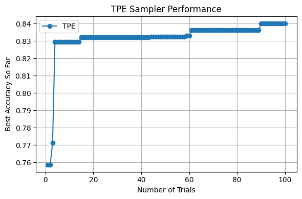

# ADLS Reports 

## Lab 0

### What we should do and what we did
In this lab we learned the basic MASE workflow. We did this by tracing a BERT-tiny classifier into a MaseGraph, running metadata analysis passes to build the MASE IR view, writing an analysis pass to count dropout modules and a transform pass to remove them, and finally training/evaluating BERT on IMDb using both supervised fine-tuning and LoRA. We also exported checkpoints so the results can be used in future labs.

### Task: remove attention_mask and labels and explain the graph changes
The graph topology changes when attention_mask and labels are removed from hf_input_names. This happens because Torch FX tracing records only the execution path taken during tracing, not every possible branch in the Python forward().

When labels is included as an FX placeholder, HuggingFace’s forward() typically takes the “labels are not None” path and traces the loss computation branch, so the graph contains an extra loss subgraph and the output includes loss (and logits). When labels is removed, labels becomes literally None during tracing, the loss branch is not executed, and that entire subgraph disappears, changing the output structure.

When attention_mask is included, the graph contains the mask-processing path feeding into the attention blocks. When it is removed, attention_mask becomes None during tracing and the model either creates a default mask internally (rewiring the mask path to depend on input_ids) or skips parts of masking logic entirely. In both cases the dependency structure changes, so the traced compute graph is genuinely different.

## Lab 1
### Task 1: Accuracy vs fixed-point width (PTQ vs QAT)

In this task we repeated the quantization workflow from Tutorial 3, where every Linear layer is quantized using a fixed-point configuration, but instead of using a single precision we swept the fixed-point width from 4 to 32 bits**. For each width we followed the same procedure as in the tutorial: we first evaluated post-training quantization (PTQ)** directly, and then ran quantization-aware training (QAT)** to fine-tune the quantized model and re-evaluated it on IMDb. The goal was to see how precision affects accuracy and to isolate the benefit of post-quantization fine-tuning.

### Plot: best accuracy achieved at each precision (PTQ vs QAT)

The figure below shows the highest evaluation accuracy obtained for each fixed-point width, with separate curves for PTQ and QAT as requested.

### Table: quantization configurations and results

The table below summarises the configurations used (total width and fractional width) and the corresponding PTQ/QAT outcomes.

| Data in Width | Data in Frac Width | PTQ: Evaluation Accuracy | QAT: Training Loss | QAT: Evaluation Accuracy |
| --- | --- | --- | --- | --- |
|  | Baseline | 0.83564 | - | 0.83564 |
| 4 | 1 | 0.5 | 0.6931 | 0.5 |
| 8 | 2 | 0.5 | 0.6931 | 0.5 |
| 16 | 4 | 0.8216 | 0.3964 | 0.84052 |
| 32 | 8 | 0.83556 | 0.3888 | 0.8414 |
| **—** | **—** | **—** | **—** | **—** |
| 4 | 2 | 0.5 | 0.6931 | 0.5 |
| 8 | 4 | 0.82284 | 0.3967 | 0.83944 |
| 16 | 8 | 0.83556 | 0.3888 | 0.8414 |
| 32 | 16 | 0.83556 | 0.3886 | 0.8418 |
| **—** | **—** | **—** | **—** | **—** |
| 4 | 3 | 0.57772 | 0.4564 | 0.8136 |
| 8 | 6 | 0.81248 | 0.3992 | 0.8378 |
| 16 | 12 | **0.83568** | **0.3884** | **0.84212** |
| 32 | 24 | 0.83564 | 0.3886 | 0.84184 |

### What the results show

Overall, accuracy improves sharply when moving from 4-bit to 8-bit**, and then largely saturates from 8-bit up to 32-bit. The PTQ results show that 4-bit is the main bottleneck**: direct PTQ at 4-bit performs poorly (0.5777), which indicates that quantization noise is too severe without adaptation. QAT, however, recovers a large amount of performance at 4-bit (0.8136), showing that post-quantization fine-tuning is essential at very low precision. At 8-bit, PTQ already approaches the floating-point baseline (0.8228 vs 0.8356), and QAT provides a smaller improvement (0.8394). Beyond 8–16 bits, the gains become marginal: PTQ is essentially at baseline, and QAT peaks around 16-bit (0.8421) with 32-bit being almost identical (0.8418). This confirms that QAT matters most when quantization error is large, and becomes less impactful once the precision is high enough that the quantized model is already close to the baseline.

### Task 2: Accuracy vs sparsity (pruning strategies)

In this task we took the best quantized model from Task 1 and applied the pruning workflow from Tutorial 4, but this time we swept the sparsity from 0.1 to 0.9. For each sparsity level we pruned the model and measured the best IMDb evaluation accuracy achieved, then compared different pruning strategies by plotting separate curves for Random and L1-norm (magnitude-based) methods.

### Plot: best accuracy achieved at each sparsity (different pruning strategies)

The figure below shows accuracy as a function of sparsity for the four combinations of weight-pruning and activation-pruning strategies, where the main comparison is between Random and L1-norm pruning.

### What the results show

The L1/L1 strategy is clearly the most robust as sparsity increases: accuracy stays close to the original performance at low-to-moderate sparsity and only degrades gradually up to around 0.7, after which it drops sharply. In contrast, Random/Random fails much earlier and reaches near-chance performance by roughly 0.6–0.7 sparsity, which suggests that randomly removing parameters destroys important structure that fine-tuning cannot reliably recover. Looking at the mixed strategies also shows that the weight-pruning choice dominates: when weights are pruned with L1 the model remains stable for longer, while randomly pruning weights causes a much earlier collapse even if activation pruning is L1-based. Finally, there is a clear “cliff zone” beyond about 0.7–0.8 sparsity where most strategies converge toward ~50% accuracy, indicating that at extreme pruning the remaining capacity is no longer sufficient for the task.

## Lab 2
### Overview 
In Tutorial 5, we implemented the NAS(neural Architecture Search) using optuna with different search sampler including Grid, Random and TPE-based search. 

#### Task 1
In task 1, we assessed the accuracy and efficiency accross between TPE and Grid samplers by running NAS for 100 trials and plot the accuracy of best model structure against trials. The result is shwon below:

#### Task 2
The primary objective of this task is to obtain an efficient model that maintains high accuracy after compression (quantization and pruning). However, simply applying a compression pipeline sequentially after a standard NAS often yields suboptimal results. An architecture that performs best in its uncompressed state may be highly sensitive to quantization or pruning, whereas a slightly less accurate architecture might exhibit greater robustness against compression. To address this discrepancy, we evaluated and compared three different workflows:
1. **Standard NAS + Post Compression Pipeline**： In this baseline approach, the compression pipeline is applied only after the optimal architecture has been found by a standard NAS (from Task 1). Since the search phase does not account for compression, there is no guarantee that the selected architecture will retain its performance after quantization and pruning.     
2. **Compression-Aware Search (Without Post Compression Training)**: In this workflow, the compression steps are integrated directly into the search loop. For each trial, the model is constructed, trained, and immediately compressed before evaluation. This method aims to find architectures that are natively robust, meaning they maintain high accuracy immediately after compression without requiring further adaptation.

3. **Compression-Aware Search with Post-Compression Training**: Similar to the second approach, compression is applied within each trial. However, crucially, we perform additional training on the compressed model before final evaluation. This step aiming to recover accuracy lost during compression. This method seeks the global optimum by finding architectures that are not just robust, but also have high "recoverability" through fine-tuning.

**The comparison of result are shown below.**

Figure 1 illustrates the search trajectory of the three different workflows over 30 trials. The specific trends for each curve are analyzed below:

* **Curve 1: Baseline (Standard NAS without Compression)**
    Represented by the **blue curve**, this trajectory serves as the performance benchmark (FP32 accuracy). It remains relatively stable and high (~0.86) which is selected dut to the **TPESampler()** is verified to obtain the best result from task1. However, since this workflow ignores compression entirely, this curve represents a "theoretical upper bound" for uncompressed models, serving as a reference point to measure the impact of quantization and pruning in the other tasks.

* **Curve 2: Compression-Aware Search (Without Post-Compression Training)**
    The **orange curve** demonstrates the highest volatility. It starts with a significantly low accuracy (~0.53), revealing that unoptimized architectures have a high inherent sensitivity to compression without being retrained. However, the curve's rapid ascent proves that the search algorithm successfully identified architectures with high native robustness. Despite this improvement, the curve plateaus below the Baseline (Curve 1), confirming that relying solely on architectural robustness is insufficient to fully recover the accuracy lost during compression.

* **Curve 3: Compression-Aware Search (With Post-Compression Training)**
    The **green curve** represents the optimal workflow. It outperforms Curve 2, verifying that retraining is essential for recovering accuracy. Most notably, this curve eventually surpasses the Baseline (Curve 1), achieving the highest final accuracy (~0.87). This may caused by additional training epochs brought by retraining process. Also the combination of compression constraints and additional retraining may acted as a form of regularization, helping the model generalize better on the dataset than the standard FP32 model.

## Lab 3

## Lab 4

