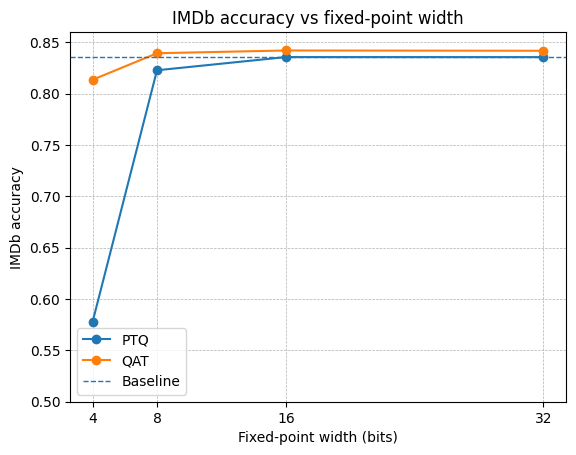
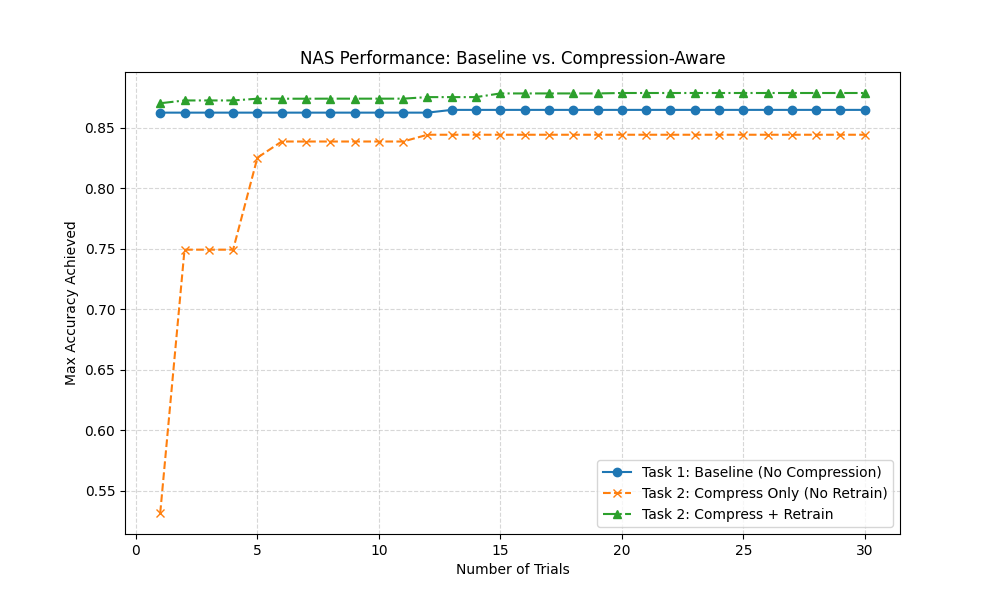
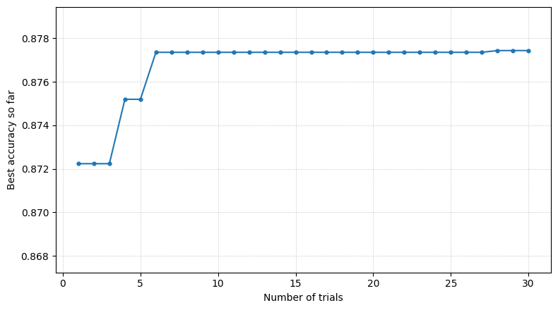

# ADLS Reports 

## Lab 0

### What we should do and what we did
In this lab we learned the basic MASE workflow. We did this by tracing a BERT-tiny classifier into a MaseGraph, running metadata analysis passes to build the MASE IR view, writing an analysis pass to count dropout modules and a transform pass to remove them, and finally training/evaluating BERT on IMDb using both supervised fine-tuning and LoRA. We also exported checkpoints so the results can be used in future labs.

### Task: remove attention_mask and labels and explain the graph changes
The graph topology changes when attention_mask and labels are removed from hf_input_names. This happens because Torch FX tracing records only the execution path taken during tracing, not every possible branch in the Python forward().

When labels is included as an FX placeholder, HuggingFace’s forward() typically takes the “labels are not None” path and traces the loss computation branch, so the graph contains an extra loss subgraph and the output includes loss (and logits). When labels is removed, labels becomes literally None during tracing, the loss branch is not executed, and that entire subgraph disappears, changing the output structure.

When attention_mask is included, the graph contains the mask-processing path feeding into the attention blocks. When it is removed, attention_mask becomes None during tracing and the model either creates a default mask internally (rewiring the mask path to depend on input_ids) or skips parts of masking logic entirely. In both cases the dependency structure changes, so the traced compute graph is genuinely different.

## Lab 1
### Task 1: Accuracy vs fixed-point width (PTQ vs QAT)

In this task we repeated the quantization workflow from Tutorial 3, where every Linear layer is quantized using a fixed-point configuration, but instead of using a single precision we swept the fixed-point width from 4 to 32 bits**. For each width we followed the same procedure as in the tutorial: we first evaluated post-training quantization (PTQ)** directly, and then ran quantization-aware training (QAT)** to fine-tune the quantized model and re-evaluated it on IMDb. The goal was to see how precision affects accuracy and to isolate the benefit of post-quantization fine-tuning.

### Plot: best accuracy achieved at each precision (PTQ vs QAT)

The figure below shows the highest evaluation accuracy obtained for each fixed-point width, with separate curves for PTQ and QAT as requested.



### Table: quantization configurations and results

The table below summarises the configurations used (total width and fractional width) and the corresponding PTQ/QAT outcomes.

| Data in Width | Data in Frac Width | PTQ: Evaluation Accuracy | QAT: Training Loss | QAT: Evaluation Accuracy |
| --- | --- | --- | --- | --- |
|  | Baseline | 0.83564 | - | 0.83564 |
| 4 | 1 | 0.5 | 0.6931 | 0.5 |
| 8 | 2 | 0.5 | 0.6931 | 0.5 |
| 16 | 4 | 0.8216 | 0.3964 | 0.84052 |
| 32 | 8 | 0.83556 | 0.3888 | 0.8414 |
| **—** | **—** | **—** | **—** | **—** |
| 4 | 2 | 0.5 | 0.6931 | 0.5 |
| 8 | 4 | 0.82284 | 0.3967 | 0.83944 |
| 16 | 8 | 0.83556 | 0.3888 | 0.8414 |
| 32 | 16 | 0.83556 | 0.3886 | 0.8418 |
| **—** | **—** | **—** | **—** | **—** |
| 4 | 3 | 0.57772 | 0.4564 | 0.8136 |
| 8 | 6 | 0.81248 | 0.3992 | 0.8378 |
| 16 | 12 | **0.83568** | **0.3884** | **0.84212** |
| 32 | 24 | 0.83564 | 0.3886 | 0.84184 |

### What the results show

Overall, accuracy improves sharply when moving from 4-bit to 8-bit**, and then largely saturates from 8-bit up to 32-bit. The PTQ results show that 4-bit is the main bottleneck**: direct PTQ at 4-bit performs poorly (0.5777), which indicates that quantization noise is too severe without adaptation. QAT, however, recovers a large amount of performance at 4-bit (0.8136), showing that post-quantization fine-tuning is essential at very low precision. At 8-bit, PTQ already approaches the floating-point baseline (0.8228 vs 0.8356), and QAT provides a smaller improvement (0.8394). Beyond 8–16 bits, the gains become marginal: PTQ is essentially at baseline, and QAT peaks around 16-bit (0.8421) with 32-bit being almost identical (0.8418). This confirms that QAT matters most when quantization error is large, and becomes less impactful once the precision is high enough that the quantized model is already close to the baseline.

### Task 2: Accuracy vs sparsity (pruning strategies)

In this task we took the best quantized model from Task 1 and applied the pruning workflow from Tutorial 4, but this time we swept the sparsity from 0.1 to 0.9. For each sparsity level we pruned the model and measured the best IMDb evaluation accuracy achieved, then compared different pruning strategies by plotting separate curves for Random and L1-norm (magnitude-based) methods.

### Plot: best accuracy achieved at each sparsity (different pruning strategies)

The figure below shows accuracy as a function of sparsity for the four combinations of weight-pruning and activation-pruning strategies, where the main comparison is between Random and L1-norm pruning.


### What the results show

The L1/L1 strategy is clearly the most robust as sparsity increases: accuracy stays close to the original performance at low-to-moderate sparsity and only degrades gradually up to around 0.7, after which it drops sharply. In contrast, Random/Random fails much earlier and reaches near-chance performance by roughly 0.6–0.7 sparsity, which suggests that randomly removing parameters destroys important structure that fine-tuning cannot reliably recover. Looking at the mixed strategies also shows that the weight-pruning choice dominates: when weights are pruned with L1 the model remains stable for longer, while randomly pruning weights causes a much earlier collapse even if activation pruning is L1-based. Finally, there is a clear “cliff zone” beyond about 0.7–0.8 sparsity where most strategies converge toward ~50% accuracy, indicating that at extreme pruning the remaining capacity is no longer sufficient for the task.

## Lab 2
### Overview 
In Tutorial 5, we implemented the NAS(neural Architecture Search) using optuna with different search sampler including Grid, Random and TPE-based search. 

#### Task 1
In task 1, we assessed the accuracy and efficiency accross between TPE and Grid samplers by running NAS for 30 trials and plot the accuracy of best model structure against trials. The result is shwon below:


#### Task 2
The primary objective of this task is to obtain an efficient model that maintains high accuracy after compression (quantization and pruning). However, simply applying a compression pipeline sequentially after a standard NAS often yields suboptimal results. An architecture that performs best in its uncompressed state may be highly sensitive to quantization or pruning, whereas a slightly less accurate architecture might exhibit greater robustness against compression. To address this discrepancy, we evaluated and compared three different workflows:
1. **Standard NAS + Post Compression Pipeline**： In this baseline approach, the compression pipeline is applied only after the optimal architecture has been found by a standard NAS (from Task 1). Since the search phase does not account for compression, there is no guarantee that the selected architecture will retain its performance after quantization and pruning.     
2. **Compression-Aware Search (Without Post Compression Training)**: In this workflow, the compression steps are integrated directly into the search loop. For each trial, the model is constructed, trained, and immediately compressed before evaluation. This method aims to find architectures that are natively robust, meaning they maintain high accuracy immediately after compression without requiring further adaptation.

3. **Compression-Aware Search with Post-Compression Training**: Similar to the second approach, compression is applied within each trial. However, crucially, we perform additional training on the compressed model before final evaluation. This step aiming to recover accuracy lost during compression. This method seeks the global optimum by finding architectures that are not just robust, but also have high "recoverability" through fine-tuning.


**The comparison of result are shown below.**

Figure 1 illustrates the search trajectory of the three different workflows over 30 trials. The specific trends for each curve are analyzed below:



* **Curve 1: Baseline (Standard NAS without Compression)**
    Represented by the **blue curve**, this trajectory serves as the performance benchmark (FP32 accuracy). It remains relatively stable and high (~0.86) which is selected dut to the **TPESampler()** is verified to obtain the best result from task1. However, since this workflow ignores compression entirely, this curve represents a "theoretical upper bound" for uncompressed models, serving as a reference point to measure the impact of quantization and pruning in the other tasks.

* **Curve 2: Compression-Aware Search (Without Post-Compression Training)**
    The **orange curve** demonstrates the highest volatility. It starts with a significantly low accuracy (~0.53), revealing that unoptimized architectures have a high inherent sensitivity to compression without being retrained. However, the curve's rapid ascent proves that the search algorithm successfully identified architectures with high native robustness. Despite this improvement, the curve plateaus below the Baseline (Curve 1), confirming that relying solely on architectural robustness is insufficient to fully recover the accuracy lost during compression.

* **Curve 3: Compression-Aware Search (With Post-Compression Training)**
    The **green curve** represents the optimal workflow. It outperforms Curve 2, verifying that retraining is essential for recovering accuracy. Most notably, this curve eventually surpasses the Baseline (Curve 1), achieving the highest final accuracy (~0.87). This may caused by additional training epochs brought by retraining process. Also the combination of compression constraints and additional retraining may acted as a form of regularization, helping the model generalize better on the dataset than the standard FP32 model.


## Lab 3
### Task 1: Mixed-precision search with per-layer IntegerLinear formats

In this task we improved the mixed-precision quantization search from Tutorial 6. The original tutorial applied the same fixed-point width and fractional width to every layer that was converted to IntegerLinear, which is not ideal because different layers in BERT do not have the same sensitivity to quantization. We therefore modified the code so that each torch.nn.Linear layer could independently either remain full precision or be replaced by LinearInteger, and if it was replaced, its integer format could be chosen from width ∈ {8, 16, 32} and fractional width ∈ {2, 4, 8}. These per-layer choices were exposed as additional Optuna hyperparameters and explored using a TPE sampler.

After rerunning the Optuna search, we plotted the running maximum IMDb accuracy as a function of trial number. The curve rises quickly in the first few trials and then plateaus, which indicates that the sampler finds strong mixed-precision configurations early and that further trials produce diminishing returns under the same one-epoch training budget.



The data shows three clear behaviours. First, there is a rapid improvement in the first few trials, where the best accuracy increases from roughly 0.872 to about 0.877 within around six trials. Second, there is a long plateau where the best value stays essentially unchanged across many subsequent trials, suggesting either that the search has already reached the practical ceiling for this setup or that better configurations are rare and would require more exploration or a larger training budget to distinguish. Third, there are occasional catastrophic trials that fall to about 0.5 accuracy, which is near chance on IMDb, showing that certain layer/format combinations can destabilise the model even when most other sampled configurations remain usable. The two low-accuracy outliers (≈0.5) are not visible in the plot because it shows the running best accuracy so far, so trials that do not improve the current best never appear as points on the curve.

A key takeaway from inspecting the best trials is that mixed precision works because some layers tolerate integer formats well while others do not. The top-performing configurations typically quantize “safer” blocks (such as attention output and parts of the feed-forward sublayers) while leaving the most sensitive layers in full precision. This directly supports the motivation for per-layer search: using one global bitwidth is unnecessarily restrictive and can waste precision where it is not needed while harming layers that require higher fidelity.

### Which layers are consistently safe vs sensitive
Looking across the best-performing trials, the layer-level pattern is very consistent. Layers corresponding to attention output projections and the later feed-forward dense layers are almost always quantized in the top results without harming accuracy, which suggests these blocks are comparatively tolerant to reduced precision. In contrast, attention query/key projection layers and the classifier head are usually kept in full precision in the best trials, and trials that quantize these components are much more likely to lose accuracy or even collapse to chance performance. The practical conclusion is that the model’s decision boundary depends heavily on the fidelity of Q/K projections and the final classifier mapping, whereas other linear layers can often be quantized aggressively with minimal impact, making them the best targets for mixed-precision savings.

## Lab 4
### 1.a
#### Analysis
The observation that the first run yields no speedup (or is even slower) is an expected behavior due to the Just-In-Time compilation overhead inherent to `torch.compile()`. The optimization process executes only when the model is first called with data. This process involves three distinct stages:
1. TorchDynamo: Upon the first execution, TorchDynamo analyzes the code to separate PyTorch operations from standard Python code and constructs an FX Graph. This graph capture process is generally efficient and does not significantly contribute to the latency.

2. Autograd: AOT Autograd generate backward graph according to forward graph to ensure gradients can be calculated correctly during training. This step also consumes an acceptable amount of time.

3. TorchInductor: The most time-consuming stage is TorchInductor, which acts as the compiler. It lowers the FX graph into optimized assembly code:

 - On CPU: It generates C++ code and compiles it into machine code using GCC or LLVM.

 - On GPU: It generates Triton kernels and compiles NVCC
#### Result
Following table illustrate the result comparing first run and subsequent run of torch.compile() on CPU
|Models | First Run | Subsequent Run |
| :--- | :----: | ---: |
| Raw model (CPU)| 3.7306s | 3.5491s |
| Optimized model (CPU) | 3.8752s |  2.1237s|

### 1.b
When changing device to NVIDIA RTX A6000。
|Models | First Run | Subsequent Run |
| :--- | :----: | ---: |
| Raw model (GPU)| 0.1907s | 0.0251s |
| Optimized model (GPU) | 3.1104s |  0.0201s|


Still, the significant latency observed in the first run is due to the compilation overhead of stages in `torch.compile()`

For the subsequent acceleration, the speedup on GPU is limited. For analysis, i would say PyTorch's already leverages highly optimized libraries (e.g., cuBLAS, cuDNN) for compute-bound operations. Therefore, the potential for further optimization via Kernal fusion is limited.

### 2.a
```
import torch.utils.benchmark as benchmark

device = "cpu"

#....

model_unfused = ScaledDotProductAttention()
model_fused = ScaledDotProductAttentionFused()
num_threads = 1 

print(f"\n start (Threads={num_threads})...")

t0 = benchmark.Timer(
    stmt='fn(q, k, v)',
    globals={'fn': model_unfused, 'q': query, 'k': key, 'v': value},
    num_threads=num_threads,
    label='Attention Comparison',
    sub_label='Unfused (Baseline)',
    description='shape=(32,8,128,64), fp16'
)

t1 = benchmark.Timer(
    stmt='fn(q, k, v)',
    globals={'fn': model_fused, 'q': query, 'k': key, 'v': value},
    num_threads=num_threads,
    label='Attention Comparison',
    sub_label='Fused (Optimized)',
    description='shape=(32,8,128,64), fp16'
)

res_unfused = t0.blocked_autorange(min_run_time=1.0)
res_fused = t1.blocked_autorange(min_run_time=1.0)
print(res_unfused)
print(res_fused)

# compare speedup
time_unfused = res_unfused.median
time_fused = res_fused.median
speedup = time_unfused / time_fused

print("-" * 40)
print(f"Result Summary:")
print(f"Unfused Time: {time_unfused * 1000:.4f} ms")
print(f"Fused Time:   {time_fused * 1000:.4f} ms")
print(f"🚀 Speedup:   {speedup:.2f}x")
print("-" * 40)
```
Above code compares the fused_kernal with naive kernal on speed using  `torch_benchmark_timer`.
Result are shown in below.
|kernal | time | speedup|
| :--- | :----: | ---: |
| Naive kernal| 301.6185ms | |
| Fused kernal | 53.6211 ms | 5.62x|

### 2.b
By switch device to cuda, result shows an huge background speedup ~3000x speedup for naive kernal imlementation. 

Still, fused kernal is better than naive implementation, whith 3.19x speedup
|kernal | time | speedup|
| :--- | :----: | ---: |
| Naive kernal|0.1075 ms | |
| Fused kernal | 0.0337 ms| 3.19x|

### 3.a
If quantized weight and activation from FP to MXINT8, the computing power would increase, MXINT8 is bascally in form of 8-bit integer (effective bitwidth change little bit with block_size) so hardware designers can fit more of them onto the same size chip.
Also, MXINT8 saves compute from sharing exponent, but the expressive power for each number is still 16bit(1 bit sign, 8bit exp and 8bit of mantissa). so this keeps accuracy which is important for model.


### 3.b


Dequantization Logic: MXINT8 to BF16This section demonstrates the step-by-step logic for dequantizing MXINT8  into BFloat16 format.


The key here is to correctly handling the Implicit Leading Bit. 
- BFloat16 assumes a normalized format: $1.mantissa$. It does not store the leading 1.
- MXINT8 is a standard integer: $sx.xx\_xxxx$. It stores all bits explicitly. 

To convert correctly, we used `dont_need_abs` and `bias`.

**step 1**
First, we extract sign bit and the exponent. We shift them into the correct bit positions for BF16.
```
auto sign = static_cast<uint16_t>(hX[i] & 0x80) << 8;
auto exp = static_cast<uint16_t>(hScales[i / group_size]) << 7;
```
**Step 2**: Construct the Mantissa
Next, we take the lower 6 bits of the absolute integer value and place them into the BF16 mantissa field.
```
auto mantissa_abs = abs(hX[i]);
// Extract lower 6 bits and align, one bit shift left as BF16 has 7     
// mantissa bit
auto frac = static_cast<uint16_t>((mantissa_abs & 0x3F) << 1); 
auto out = cutlass::bfloat16_t::bitcast(sign | exp | frac);
```
The problem here is, by placing bits into BF16 directly, the hardware automatically accept this value as $1.xxxxxx0$ (due to the implicit leading 1). We must check if this matches the original integer.

 **step 3** We check the 7th bit (Bit 6) of the original MXINT8 integer to decide if a correction is needed.

1. We verify if the original number had a leading 1  or leading 0.
```
auto dont_need_abs = bool(mantissa_abs & 0x40); 
// Checks the 7th bit
```
2. We construct a bias representing exactly $1.0 \times 2^{Exp}$.
```
auto bias = cutlass::bfloat16_t::bitcast(sign | exp | uint16_t(0));
```
We apply the correction based on the 7th bit check:
- If 7th bit is 1 `dont_need_abs = True`)
    - The original MXINT8 integer was in the form 1.xxxxxx. 
    - BFloat16 interpretation is 1.xxxxxx0.Result: 
    - They match. No adjustment needed.
- If 7th bit is 0 `dont_need_abs = False`
    - The original integer was in the form 0.xxxxxx.
    -   BFloat16 interpretation is 1.xxxxxx0. 
    - we ned to correct this by minus 1.0000000(bias) from the wrong BF16 number.
```
y[i] = dont_need_abs ? out : out - bias;
```


### 3.c
#### 3.c.1
To maximize GPU throughput, it is necessary to evenlly distribute worklda to thread block(CTA), `cta_tiler` tiles the Global thread grid into thread block and `cta_coord` maps the data to each of the thread blocks. This will gaurentee maximum parallelism.
#### 3.c.2
In thread block there are multiple threads,`layout_sX` is responsible for tread mapping.


### 3.d
The experiment observed a 66.4% reduction in peak GPU memory usage, which is less than theoretical value of 74.2% calculated by the formula $\frac{32 - (8 + 8/32)}{32}$.

The reason for this difference is because the theoretical formula assumes an ideal case where the entire model is compressed from FP32 to MXINT8, However, the actual implementation is a Weight-Only Quantization, which is showned by following code snipt.
```
for layer_name, layer in model.named_modules():
    if not isinstance(layer, torch.nn.Linear):
        continue
    if "classifier" in layer_name:
        continue
    layer.cuda()
    layer_q = QLinearPacked.build_from_linear(layer, group_size=mxint8_group_size)
    set_layer_by_name(model, layer_name, layer_q)
    del layer
    torch.cuda.empty_cache()
``` 
1. The implemented quantization (`QLinearPacked`) compresses the static model weights but does not quantize the dynamic activations (intermediate results) generated during inference.
2. The quantization script select and only quantize t`orch.nn.Linear` layers, leaving other layer in high precision format.
3. There are system overhead also occupies memory, e.g kernal code, also memory allocation of pytorch may not be ideal, this may result allocate more memory than needed to prevent cases such as fragmentation.